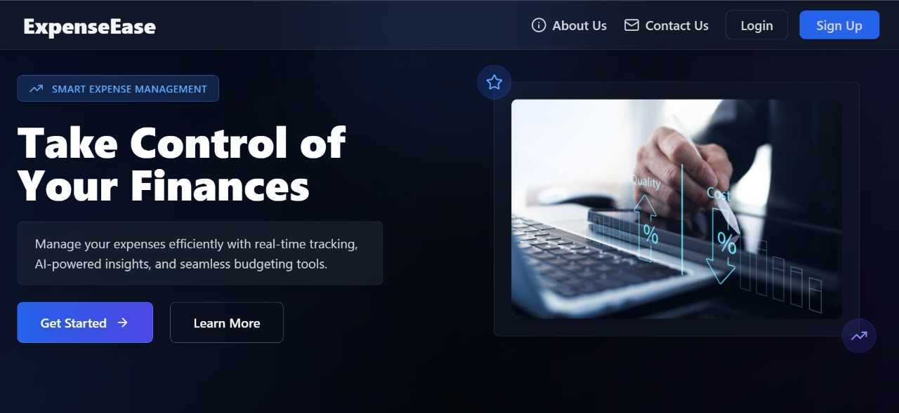
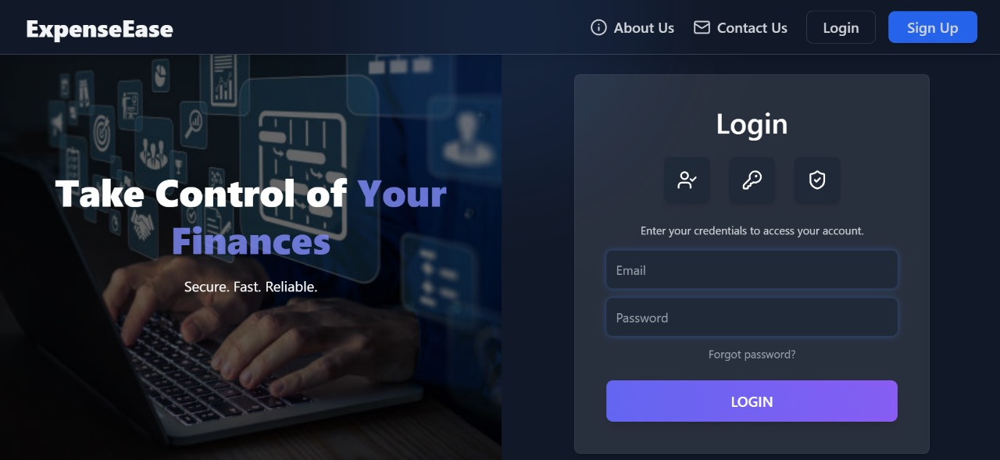
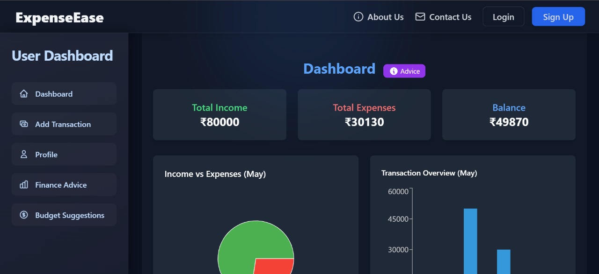
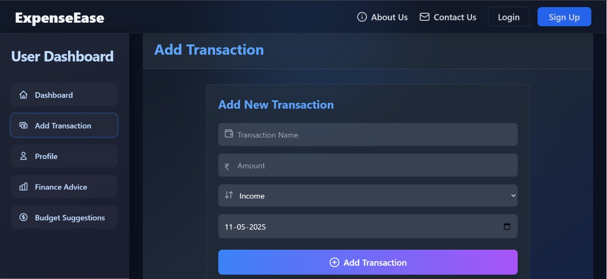
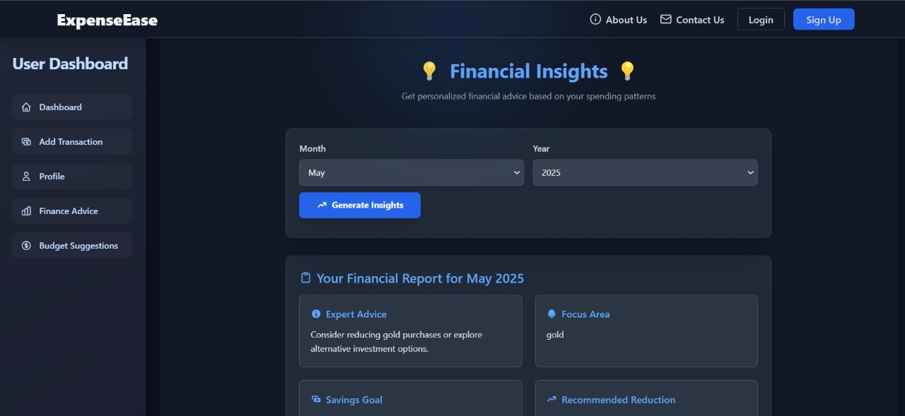
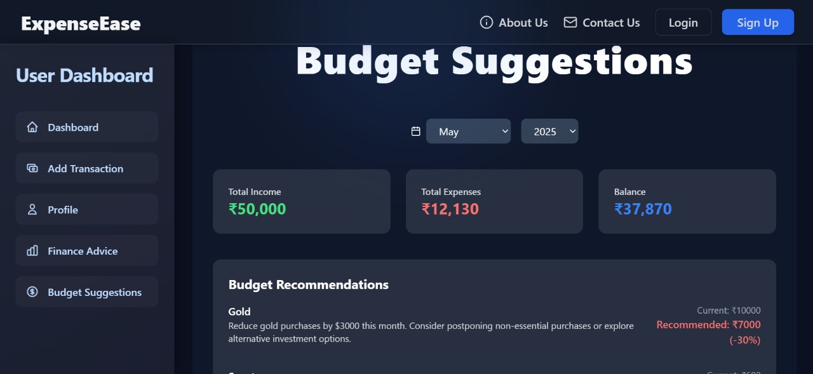

# 💰 ExpenseEase - Modern Expense Management App

## 🌐 Live Website  
👉 [https://stexpenseease.netlify.app/](https://stexpenseease.netlify.app/)

---

## ✨ Key Features
- **📊 Real-time Dashboard** - Visualize your spending patterns  
- **🔍 Smart Filtering** - Filter by date, category, or amount  
- **📱 Mobile Optimized** - Works flawlessly on all devices  
- **🔐 Secure Auth** - Protected user accounts  
- **🌗 Dark Mode** - Eye-friendly dark theme  
- **📈 Analytics** - Monthly/yearly spending insights  
- **💾 Data Export** - Download your expense history  

---

## 🖼 Screenshots

<p align="center">
  
  <br />
  <em>🏠 Home Page – Clean and modern landing interface</em>
</p>

<p align="center">
  
  <br />
  <em>🔐 Login Page – Secure authentication screen</em>
</p>

<p align="center">
  
  <br />
  <em>📊 Dashboard – Real-time spending analytics and summaries</em>
</p>

<p align="center">
  
  <br />
  <em>➕ Add Transaction – Log new expenses with categories and notes</em>
</p>

<p align="center">
  
  <br />
  <em>💡 Financial Advice – Smart money-saving tips based on your habits</em>
</p>

<p align="center">
  
  <br />
  <em>📈 Budget Suggestion – Suggested budgets based on monthly expenses</em>
</p>

---

## 🛠 Technology Stack

| Category        | Technologies                                                                 |
|-----------------|------------------------------------------------------------------------------|
| **Frontend**    | React, Next.js, TypeScript, Tailwind CSS, Chart.js                           |
| **Backend**     | Node.js, Next.js API routes                                                  |
| **Database**    | MongoDB (or your actual DB)                                                  |
| **State**       | React Context API                                                            |
| **Deployment**  | Vercel                                                                       |
| **Testing**     | Jest, React Testing Library                                                  |

---

## 🚀 Quick Start

### Prerequisites
- Node.js v16+
- npm/yarn
- MongoDB Atlas account (if using DB)

### Installation

```bash
# Clone the repository
git clone https://github.com/SoftechInfowayss/Expensemanager

# Navigate to project directory
cd expenseease

# Install dependencies
npm install

# Set up environment variables
cp .env.example .env.local

# Start development server
npm run dev
